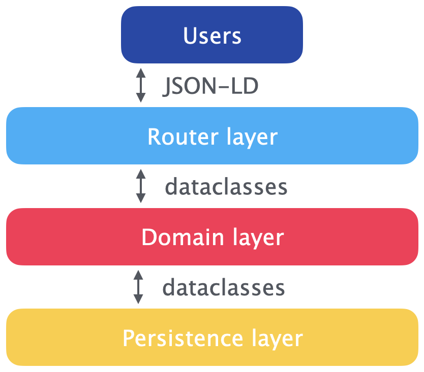

# Architecture

## Overview

The software architecture of PyST is divided into three layers: router, application, and persistence. Each has its own [data transfer objects (DTO)](https://en.wikipedia.org/wiki/Data_transfer_object), protocols, and unit tests.

{ width=300 }

Each layer is independent, and can only communicate with other layers through defined protocols.

## Router

!!! info

    [Source code for router endpoints](https://github.com/cauldron/py-semantic-taxonomy/blob/main/src/py_semantic_taxonomy/adapters/routers/router.py), [pydantic classes for incoming data](https://github.com/cauldron/py-semantic-taxonomy/blob/main/src/py_semantic_taxonomy/adapters/routers/request_dto.py), [pydantic classes for outgoing data](https://github.com/cauldron/py-semantic-taxonomy/blob/main/src/py_semantic_taxonomy/adapters/routers/response_dto.py)

PyST uses FastAPI to define ReST API endpoints. All API endpoints consume and emit JSON-LD.

!!! Note

    ReST API endpoints have [separate documentation](https://docs.pyst.dev/api/).

After using [pydantic](https://docs.pydantic.dev/latest/) to validate incoming data, the endpoint functions create [dataclasses](https://docs.python.org/3/library/dataclasses.html) for use in application logic, and call the appropriate application service functions.

## Application

!!! info

    [Application graph protocol](https://github.com/cauldron/py-semantic-taxonomy/blob/main/src/py_semantic_taxonomy/domain/ports.py#L76), [application search protocol](https://github.com/cauldron/py-semantic-taxonomy/blob/main/src/py_semantic_taxonomy/domain/ports.py#L150), [DTO dataclasses](https://github.com/cauldron/py-semantic-taxonomy/blob/main/src/py_semantic_taxonomy/domain/entities.py)

Application functionality is implemented via service classes; we currently have two services, a [graph service](https://github.com/cauldron/py-semantic-taxonomy/blob/main/src/py_semantic_taxonomy/application/graph_service.py) and a [search service](https://github.com/cauldron/py-semantic-taxonomy/blob/main/src/py_semantic_taxonomy/application/search_service.py). Services _do not persist_ data, but perform operations on data to either provide responses to users or prepare data for persistence.

Application functions can call the persistence layer during function execution, or when finished. The DTO between the application and persistence layers and the same as between the router and application layers.

## Persistence

!!! info

    [Persistence graph protocol](https://github.com/cauldron/py-semantic-taxonomy/blob/main/src/py_semantic_taxonomy/domain/ports.py#L17), [persistence search protocol](https://github.com/cauldron/py-semantic-taxonomy/blob/main/src/py_semantic_taxonomy/domain/ports.py#L133), [DTO dataclasses](https://github.com/cauldron/py-semantic-taxonomy/blob/main/src/py_semantic_taxonomy/domain/entities.py)

The persistence layer makes the actual calls to the Postgres and Typesense databases. The structure of the application and persistence protocols are quite similar; in general, business logic should go in the application layer, and the persistence layer should only be for interfacing with the databases, but in practice this distinction can get fuzzy.
