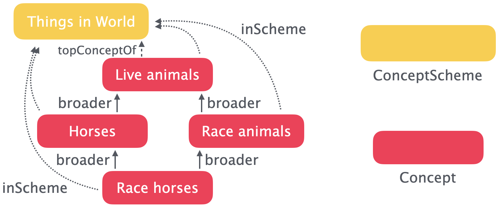
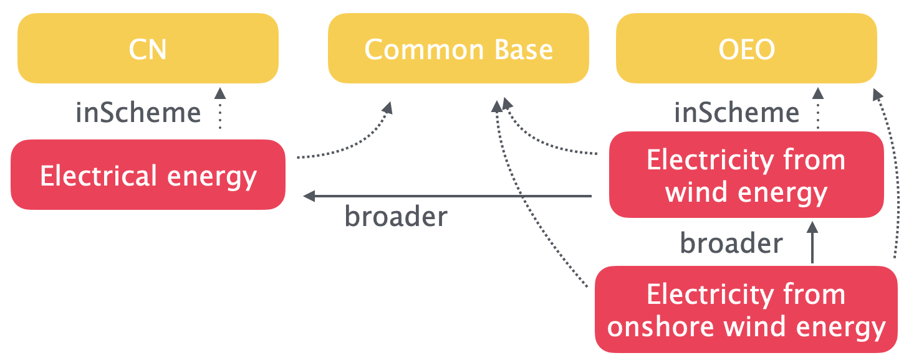
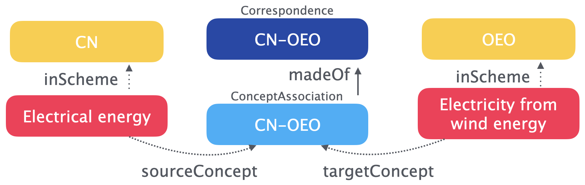
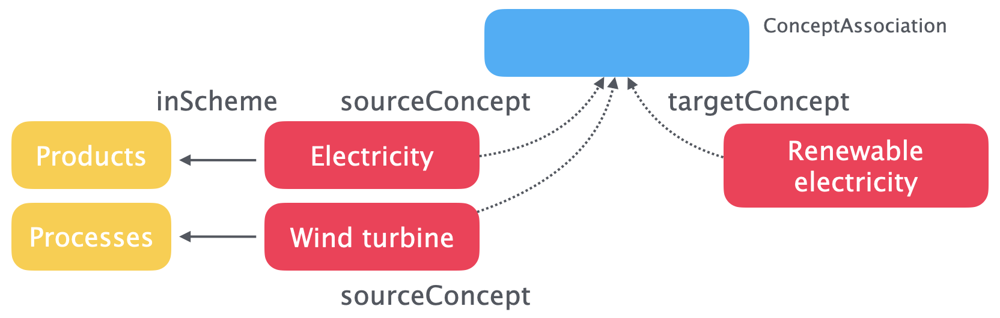

# Data Model

## Overview

The data model PyST has four fundamental classes: SKOS [Concept](https://www.w3.org/TR/skos-primer/#secconcept), SKOS [ConceptScheme](https://www.w3.org/TR/skos-primer/#secscheme), XKOS [Correspondence](https://rdf-vocabulary.ddialliance.org/xkos.html#correspondences), and XKOS [ConceptAssociation](https://rdf-vocabulary.ddialliance.org/xkos.html#correspondences).

### `Concept` and `ConceptScheme`

Each `Concept` belongs to at one `ConceptSchema`. "Belonging" is given with the `Concept.inScheme` property.



These `Concept` relationships in a given `ConceptScheme` form a graph. Each "root" in the graph is a "top" `Concept` - i.e. a `Concept` which has _incoming_ `skos:broader` relationships, but no _outgoing_ `skos:broader` relationships. SKOS has a potentially confusing way of encoding `skos:broader` and `skos:narrower`, because the [semantic triple](https://en.wikipedia.org/wiki/Semantic_triple) `A skos:broader B` means that object `A` has a relationship to a broader object `B`, **not** that `A` is broader than `B` (just the opposite!). SKOS uses `skos:topConceptOf` to mark these "top" `Concept` objects.

`ConceptScheme` graphs are [directed acyclic graphs](https://en.wikipedia.org/wiki/Directed_acyclic_graph). They are directed because their edges (`A skos:broader B`) have direction and are not symmetric; they are acyclic because of their nature in describing taxonomies which always get broader as one goes "up" the hierarchy towards the "top" `Concepts`.

A PyST deployment will normally have many `ConceptScheme` graphs, and these individual graphs can be linked in several ways. `Concepts` can belong to more than one `ConceptScheme` - for example, we will be using the [Combined Nomenclature or CN](https://taxation-customs.ec.europa.eu/customs-4/calculation-customs-duties/customs-tariff/combined-nomenclature_en) as a base classification for products, but supplementing it with more specific graphs (like the [Open Energy Ontology or OEO](https://openenergyplatform.org/ontology/)) when more detail is needed. As [is discussed below](#hierarchical-and-associative-concept-relationships), we can't have hierarchical relationships which cross `ConceptScheme` graphs, but if introduce a third common `ConceptScheme` we can create hierarchies which span input `ConceptSchemes`:



### `ConceptAssociation` and `Correspondence`

`ConceptAssociation` and `Correspondence` are another fundamental type of relationship we can put in the graph. Just like the SKOS term `ConceptScheme` serves as an organizational unit for `Concepts`, the XKOS term `Correspondence` is an organizational unit for these `ConceptAssociations`.



While the XKOS standard does allow M-to-N mappings (i.e. multiple concepts in one concept scheme mapping to multiple concepts in another concept scheme), we require that each concept in the source concept scheme be mapped separately to the appropriate target concepts.

One frustration of the current XKOS standard is that no additional properties for describing the qualities of `ConceptAssociation` are offered: "In this version, XKOS does not define any properties or sub-classes for `xkos:Correspondence` and `xkos:ConceptAssociation` in order to model these different types of correspondences. This may be added in a future version." ([Source](https://rdf-vocabulary.ddialliance.org/xkos.html#correspondences)). This means that if we want to indicate the _quality_ of a mapping between two `Concepts` in addition to their membership in a `ConceptAssociation`, we would need to create a separate [associative](#hierarchical-and-associative-concept-relationships) relationship. Note that this means that these associative properties will not be linked directly to the `ConceptAssociation` instance.

We don't assume reciprocity for `ConceptAssociations` - i.e. if source `A` is mapped to target `B`, it doesn't mean that source `B` is mapped to target `A`.

## Conditional `ConceptAssociation`

In certain cases a `Concept` in scheme `A` can correspond to a `Concept` in scheme `B`, but only when it is paired with another `Concept` from scheme `C`. For example, `A:electricity` is equivalent to `B:renewable_electricity` when it is produced by `C:wind_turbine`.

We will slightly abuse the `ConceptAssociation` class to meet this modelling need by allowing `ConceptAssociation` to link *three* `ConceptSchemes`. In this case, each `ConceptAssociation` should have *two* `sourceConcepts` and *one* `targetConcept`.



Note that conditionality here is implicit - it is not given by a specific property but only because there are two `sourceConcepts`.

!!! warning

    Our usage here differs from [XKOS best practices](https://linked-statistics.github.io/xkos/xkos-best-practices.html). Please reach out to `info@cauldron.ch` if you have alternative ideas on how to implement conditional association.

## Hierarchical and associative `Concept` relationships

A [_hierarchical_ relationship](https://www.w3.org/TR/2005/WD-swbp-skos-core-guide-20051102/#sechierarchy) is a `skos:broader` or `skos:narrower` (or `skos:broaderTransitive`/`skos:narrowerTransitive`) relationship within a `ConceptScheme` taxonomy. An [_associative_ relationship](https://www.w3.org/TR/2005/WD-swbp-skos-core-guide-20051102/#secassociative) crosses from one `ConceptScheme` to another, or from one "branch" of a `ConceptScheme` to another, and uses the SKOS properties `skos:related`, `skos:exactMatch`, `skos:closeMatch`, `skos:relatedMatch`, `skos:broadMatch`, and `skos:narrowMatch`.

You shouldn't specify associative relationships for two concepts which are related through a transitive chain of `skos:broader` relationships. PyST does some basic checks to enforce this distinction, though because we allow `Concepts` to belong to more than one `ConceptScheme` it's difficult to do comprehensive checks.

## General constraints and assumptions

PyST is a opinionated software - it puts additional constraints on the SKOS and XKOS ontologies to ensure consistency and usability.

PyST uses the [open-world assumption](https://en.wikipedia.org/wiki/Closed-world_assumption) in its logic. The open-world assumption is that there are facts which are true but are not stated in our system. So, for example, just because our system doesn't have a `skos:broader` relationship or a `ConceptAssociation` between two `Concepts` doesn't mean that those links don't exist - just that we don't know abot them yet.

There are a few general constraints which are applied to all classes:

* We assume that `Concepts` within a `ConceptScheme` have a strictly **transitive hierarchy** - e.g. if `A` is broader than `B`, and `B` is broader than `C`, then `A` is always broader than `C`. There is therefore no need to specify `broaderTransitive` or `narrowerTransitive`, as these are implicit in the taxonomy graph. Similarly, as `broader` and `narrower` are reciprocal, API inputs should only specify `broader` relationships - giving both sides of a `broader`/`narrower` relationship will raise a `DuplicateRelationship` error.
* Incoming data must be JSON-LD in the [JSON-LD 1.1 expanded form](https://www.w3.org/TR/json-ld11/#expanded-document-form). Expanded form means that there is no `@context` section of the JSON-LD document.

!!! note

    If you are using [rdflib](https://rdflib.readthedocs.io/en/7.1.1/index.html), you may run into trouble with nested namespaces. Specifying `version=1.1` during parsing (i.e. `rdflib.Graph().parse(..., version="1.1")` or reading and re-serializing with [PyLD](https://github.com/digitalbazaar/pyld) should work.

* All string literals **must** specify a language and _can_ specify a direction. In other words, `"ceci n'est pas une pipe"` is not allowed - you must instead give `{"@language": "fr", "@value": "ceci n'est pas une pipe"}`.
* Only one `skos:prefLabel` and one `skos:definition` per language code are allowed.
* If specifying a version using `owl:versionInfo`, only one value is allowed.

## Tracking changes

We follow the SKOS Primer guidance on [documentary notes](https://www.w3.org/TR/skos-primer/#secdocumentation) for the fields `skos:changeNote`, `skos:editorialNote`, and `skos:historyNote`:

* `skos:changeNote` documents fine-grained changes to a concept, for the purposes of administration and maintenance, e.g. "Moved from under 'fruits' to under 'vegetables' by Horace Gray"
* `skos:editorialNote` supplies information that is an aid to administrative housekeeping, such as reminders of editorial work still to be done, e.g. "Check spelling with John Doe"
* `skos:historyNote` describes significant changes to the meaning or the form of a concept, e.g. "estab. 1975; heading was: Cruelty to children [1952-1975]"

All three of these notes are required to be RDF resources instead of string literals, and in addition to their values (`rdf:value`), they **must** also include a creator (`dcterms:creator`) and an issuance timestamp (`dcterms:issued`). Here is an example:

```json
{
    "http://purl.org/dc/terms/creator": [{"@id": "http://example.com/john.doe"}],
    "http://purl.org/dc/terms/issued": [
        {"@type": "http://www.w3.org/2001/XMLSchema#date", "@value": "1999-01-23"}
    ],
    "http://www.w3.org/1999/02/22-rdf-syntax-ns#value": [
        {"@language": "en", "@value": "Moved from under 'fruits' to under 'vegetables'"}
    ],
}
```

## Publication status

SKOS and XKOS don't provide constructs for tracking status. We have [chosen to use](https://github.com/cauldron/py-semantic-taxonomy/issues/16) a subset of the [BIBO](https://en.wikipedia.org/wiki/Bibliographic_Ontology) ontology, and support three different status options:

* draft (`http://purl.org/ontology/bibo/status/draft`)
* accepted (`http://purl.org/ontology/bibo/status/accepted`)
* rejected (`http://purl.org/ontology/bibo/status/rejected`)

The predicate verb is `http://purl.org/ontology/bibo/status`.

## `ConceptScheme`

We impose the following additional constraints on `ConceptScheme` objects:

* At least one `skos:prefLabel` and one `skos:definition` are required
* `bibo:status`, `dcterms:created`, `owl:versionInfo` are required
* Exactly one `owl:versionInfo` value is specified
* At least one definition (`skos:definition`) is given
* Instead of supplying a (very long) list of `skos:hasTopConcept` concept references, please instead specify `skos:topConceptOf` on the `Concept` instances.

Here is a minimal `ConceptScheme` example:

```json
{
  "@id": "http://data.europa.eu/xsp/cn2024/cn2024",
  "@type": [
    "http://www.w3.org/2004/02/skos/core#ConceptScheme"
  ],
  "http://purl.org/dc/terms/created": [
    {
      "@type": "http://www.w3.org/2001/XMLSchema#dateTime",
      "@value": "2023-10-11T13:59:56"
    }
  ],
  "http://purl.org/dc/terms/creator": [
    {
      "@id": "http://publications.europa.eu/resource/authority/corporate-body/ESTAT"
    },
    {
      "@id": "http://publications.europa.eu/resource/authority/corporate-body/TAXUD"
    }
  ],
  "http://www.w3.org/2002/07/owl#versionInfo": [
    {
      "@value": "2024"
    }
  ],
  "http://purl.org/ontology/bibo/status": [
    {
      "@id": "http://purl.org/ontology/bibo/status/accepted"
    }
  ],
  "http://www.w3.org/2004/02/skos/core#prefLabel": [
    {
      "@value": "Combined Nomenclature, 2024 (CN 2024)",
      "@language": "en"
    },
    {
      "@value": "Nomenclatura Combinada, 2024 (NC 2024)",
      "@language": "pt"
    }
  ],
  "http://www.w3.org/2004/02/skos/core#definition": [
    {
      "@value": "The main classification for the European ITGS (International trade in goods statistics)  is the Combined Nomenclature (CN). This is the primary nomenclature as it is the one used by the EU Member States to collect detailed data on their trading of goods since 1988. Before the introduction of the CN, ITGS were based on a product classification called NIMEXE.  The CN is based on the Harmonised Commodity Description and Coding System (managed by the World Customs Organisation (WCO). The Harmonised System (HS) is an international classification at two, four and six-digit level which classifies goods according to their nature. It was introduced in 1988 and, since then, was revised six times: in 1996, 2002, 2007, 2012, 2017 and 2022. The CN corresponds to the HS plus a further breakdown at eight-digit level defined to meet EU needs. The CN is revised annually and, as a Council Regulation, is binding on the Member States.",
      "@language": "en"
    }
  ],
  "http://www.w3.org/2004/02/skos/core#notation": [
    {
      "@value": "CN 2024",
      "@type": "http://www.w3.org/1999/02/22-rdf-syntax-ns#PlainLiteral"
    }
  ]
}
```

## `Concept`

We impose the following additional constraints on `Concept` objects:

* At least one `skos:prefLabel` is required
* A `bibo:status` is required
* Each `Concept` must be in at least one known (i.e. in our database already) `ConceptScheme`. `Concepts` can belong to more than one `ConceptScheme`.
* `Concepts` can be in a relationship with itself. Insert your own joke here.
* The use of `skos:note` is discouraged (but not prohibited) in favor of the specific `skos:note` subclasses: `skos:scopeNote`, `skos:definition`, `skos:example`, `skos:historyNote`, `skos:editorialNote`, and `skos:changeNote`. Their use should follow the intended use as documented in the [SKOS Primer](https://www.w3.org/TR/skos-primer/#secdocumentation).
* `skos:notation` must be a [typed literal](https://www.w3.org/TR/2004/REC-rdf-concepts-20040210/#dfn-typed-literal) - not a string literal - and not include a `@language` tag. The default datatype should be `http://www.w3.org/1999/02/22-rdf-syntax-ns#PlainLiteral`.
* We **break from** [SKOS guidance](https://www.w3.org/TR/skos-reference/#L2613) to prohibit `skos:notation` having the same value as `skos:prefLabel`. A notation is ['a string of characters such as "T58.5" or "303.4833" used to uniquely identify a concept within the scope of a given concept scheme'](https://www.w3.org/TR/skos-reference/#L2064); this definition is inconsistent with [lexical labels](https://www.w3.org/TR/skos-reference/#L2831) like `skos:prefLabel`, which are human-readable and in a natural language. In our system, `skos:prefLabel` is required but `skos:notation` is optional.

Here is a minimal `Concept` example:

```json
{
  "@id": "http://data.europa.eu/xsp/cn2024/010011000090",
  "@type": ["http://www.w3.org/2004/02/skos/core#Concept"],
  "http://www.w3.org/2004/02/skos/core#inScheme": [
    {"@id": "http://data.europa.eu/xsp/cn2024/cn2024"}
  ],
  "http://purl.org/ontology/bibo/status": [
    {"@id": "http://purl.org/ontology/bibo/status/accepted"}
  ],
  "http://www.w3.org/2004/02/skos/core#prefLabel": [
    {
      "@value": "SECTION I - LIVE ANIMALS; ANIMAL PRODUCTS",
      "@language": "en"
    },
    {
      "@value": "SEC\u00c7\u00c3O I - ANIMAIS VIVOS E PRODUTOS DO REINO ANIMAL",
      "@language": "pt"
    }
  ],
  "http://www.w3.org/2004/02/skos/core#notation": [
    {
      "@value": "I",
      "@type": "http://www.w3.org/1999/02/22-rdf-syntax-ns#PlainLiteral"
    }
  ],
  "http://www.w3.org/2004/02/skos/core#definition": [
    {
      "@language": "en",
      "@value": "LIVE ANIMALS; ANIMAL PRODUCTS"
    }
  ],
  "http://www.w3.org/2004/02/skos/core#topConceptOf": [
    {"@id": "http://data.europa.eu/xsp/cn2024/cn2024"}
  ]
}
```

## Correspondence

The [XKOS](https://rdf-vocabulary.ddialliance.org/xkos.html) ontology provides the [Correspondence](https://rdf-vocabulary.ddialliance.org/xkos.html#correspondences) class definition, which we use follow the [XKOS best practice guide](http://linked-statistics.github.io/xkos/xkos-best-practices.html). A `Correspondence` instance is very similar to a `ConceptScheme` - it provides metadata for a collection of child nodes.

In addition to our [generic addition restrictions](#general-constraints-and-assumptions), `Correspondence` must have:

* Exactly one `http://purl.org/dc/terms/issued` value.

Here is an example of a valid `Correspondence` in JSON-LD:

```json
{
  "@id": "http://data.europa.eu/xsp/cn2024/CN2024_CN2023",
  "@type": ["http://rdf-vocabulary.ddialliance.org/xkos#Correspondence"],
  "http://rdf-vocabulary.ddialliance.org/xkos#compares": [
      {"@id": "http://data.europa.eu/xsp/cn2024"}
      {"@id": "http://data.europa.eu/xsp/cn2023"}
  ],
  "http://www.w3.org/2004/02/skos/core#definition": [
    {
      "@value": "This table is indicative and has no legal value.",
      "@language": "en"
    }
  ],
  "http://www.w3.org/2004/02/skos/core#prefLabel": [
    {
      "@value": "Transposition between CN 2024 and CN 2023",
      "@language": "en"
    }
  ],
  "http://purl.org/dc/terms/issued": [
    {
      "@type": "http://www.w3.org/2001/XMLSchema#dateTime",
      "@value": "2024-07-02T08:41:55"
    }
  ]
}
```

## `ConceptAssociation`

We don't impose any additional restrictions outside of the XKOS specification on `ConceptAssociation`.

XKOS doesn't provide any additional properties `ConceptAssociations`, but we can use `qudt:conversionMultiplier` to give 1-N partitioning or allocation constants. Though this isn't the intention of this predicate in [QUDT](https://qudt.org/), it domain and range fit, and allocation is similar enough to unit conversion. Please feel free to suggest an alternative if you find something which fits better!

Here is an example of a valid 1-to-N `ConceptAssociation` in JSON-LD:

```json
{
  "@id": "http://data.europa.eu/xsp/cn2024/CN2024_CN2023_010239100080",
  "@type": ["http://rdf-vocabulary.ddialliance.org/xkos#ConceptAssociation"],
  "http://rdf-vocabulary.ddialliance.org/xkos#sourceConcept": [
      {"@id": "http://data.europa.eu/xsp/cn2024/010239000080"}
  ],
  "http://rdf-vocabulary.ddialliance.org/xkos#targetConcept": [
    {
      "@id": "http://data.europa.eu/xsp/cn2024/010239900080",
      "http://qudt.org/3.0.0/schema/qudt/conversionMultiplier": 0.75
    },
    {
      "@id": "http://data.europa.eu/xsp/cn2024/010239100080",
      "http://qudt.org/3.0.0/schema/qudt/conversionMultiplier": 0.25
    }
  ]
}
```

And here is a _conditional_ `ConceptAssociation`:

```json
{
  "@id": "http://example.com/conditional",
  "@type": ["http://rdf-vocabulary.ddialliance.org/xkos#ConceptAssociation"],
  "http://rdf-vocabulary.ddialliance.org/xkos#sourceConcept": [
      {"@id": "http://example.com/A/electricity"},
      {"@id": "http://example.com/C/wind_turbine"}
  ],
  "http://rdf-vocabulary.ddialliance.org/xkos#targetConcept": [
      {"@id": "http://example.com/B/renewable_electricity"}
  ]
}
```


