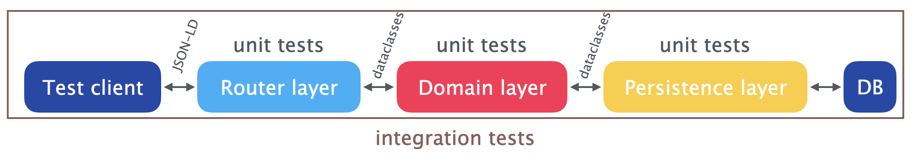

# Development and testing

## Asynchronous code

All three layers of PyST are asynchronous; most functions and methods user `async` and must be called with `await`. Developing in this style can be challenging at first; see the tests for patterns which you can follow if you need help.

## Prerequisites

Use `pip install "py-semantic-taxonomy[dev]"` to get everything needed for development and testing.

## Containers for Postgres and Typesense

Development and testing require Docker via [testcontainers](https://testcontainers.com/). On MacOS you will need a recent version of Docker Desktop - the alternatives don't seem to work.

The `scripts` directory has two scripts for running Postgres and Typesense containers:

* [start_typesense_container.py](https://github.com/cauldron/py-semantic-taxonomy/blob/main/scripts/start_typesense_container.py)
* [start-postgres-container.py](https://github.com/cauldron/py-semantic-taxonomy/blob/main/scripts/start_postgres_container.py)

If you run those scripts, you will get instructions on how to set the environment variable values needed to run the development server:

```console
python src/py_semantic_taxonomy/app.py
```

## Testing

When adding new functionality, it's important to write unit tests for each layer effected, as well as integration tests. Unit tests should *mock* the other layers - see the [conftest.py](https://github.com/cauldron/py-semantic-taxonomy/blob/main/tests/conftest.py) file for test mocks and fixture data.



## Linting

```console
isort --profile=black tests/ && black tests/ && \
isort --profile=black src/ && black src/
```
